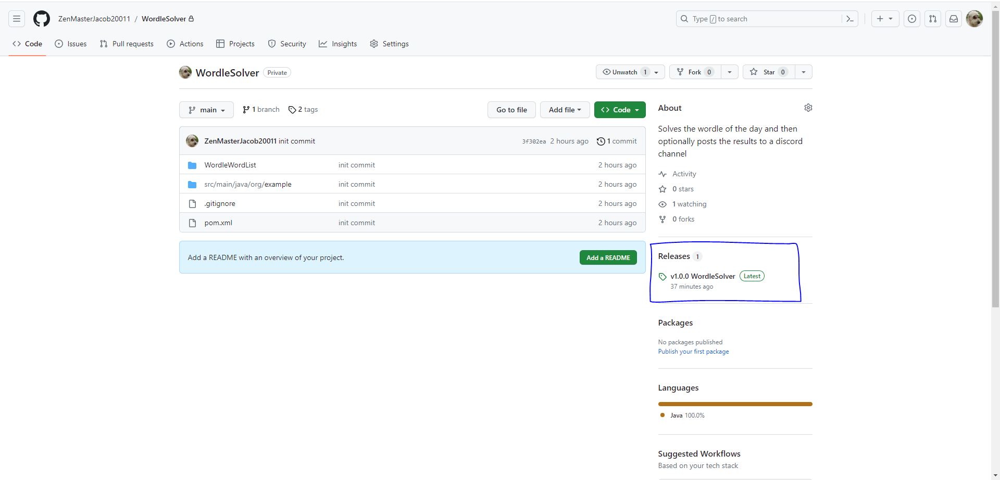
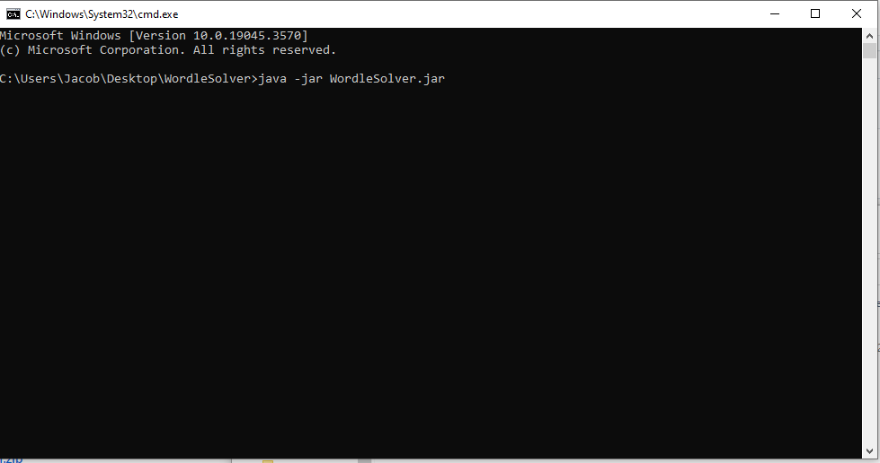

# WordleSolver
This program solves the wordle of the day and then optionally posts the results to discord channel

## How it works?
### Main program
- The program has a list of all possible wordle words and picks the first one in the list
- The program then enters the word to the DOM using selenium webdriver
- The program then retrieves the information given (using selenium) from wordle and stores the correct letters, present letters, and absent letters
- Using the correct, present, and absent letters the program can skip over words that aren't possible knowing what words are correct, present, and absent
- The program will continue to guess words using the correct, present, and absent knowledge until it either runs out of tries or guesses the correct letter
### Optional program
- After the wordle game is finished you have the option to post your results to a discord channel
- This will require your username, password, and the channel_id your want to post to
## How to run the program yourself?
### To run this program you will need the following installed on your PC:
1. Java JDK 17+ with the path to the /bin folder set on your environmental variables
    - To check if you have this, open your command prompt (cmd) and type java --version. If it says that command is not found then you either
      - Don't have Java JDK
      - Don't have your environment path variables set to Java JDK bin
### To run this program do the following:
1. Click on v1.0.0 WordleSolver under Releases

2. Download WordleSolver.zip
3. Extract folder
4. cd to WordleSolver folder
5. type "java -jar WordleSolver.jar" without quotes

6. A popup will appear asking for username, password, and channel_id information
   - Leave text fields blank or press cancel to have program only solve wordle
   - If you want results to be posted to discord you must fill out information
## Video
